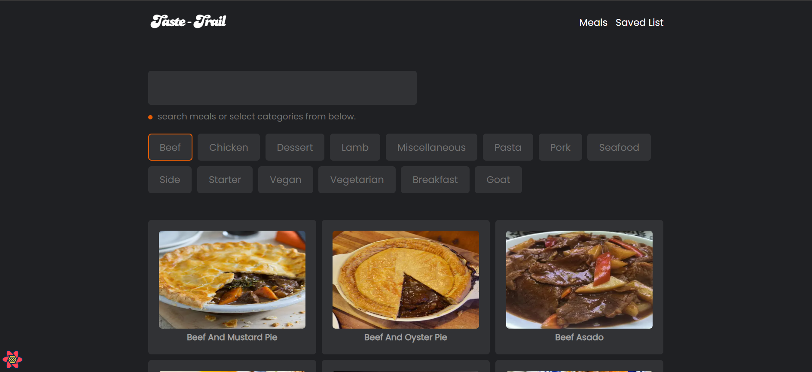

## Taste-Trail

A react (`Next.js` + `React Query`) app, where you can find meals recipe and save your favorite recipe for later.

### Tech Used

- Next.js
- React Query
- Axios
- React-hot-toast

**live preview: [https://meal-khuj.netlify.app](https://meal-khuj.netlify.app)** 
**youtube-tutorial: [https://youtu.be/JtfduKrxRH8](https://youtu.be/JtfduKrxRH8)** 
**API used: [themealdb](https://www.themealdb.com/api.php)**

---

Happy Coding! ✨🚀

[notramm-ig]: http://instagram.com/notramm
[wc-ig]: http://instagram.com/web_cifar
[wc-projects]: https://github.com/ShaifArfan/wc-project-tutorials
[wc-fb-group]: https://www.facebook.com/groups/webcifar
